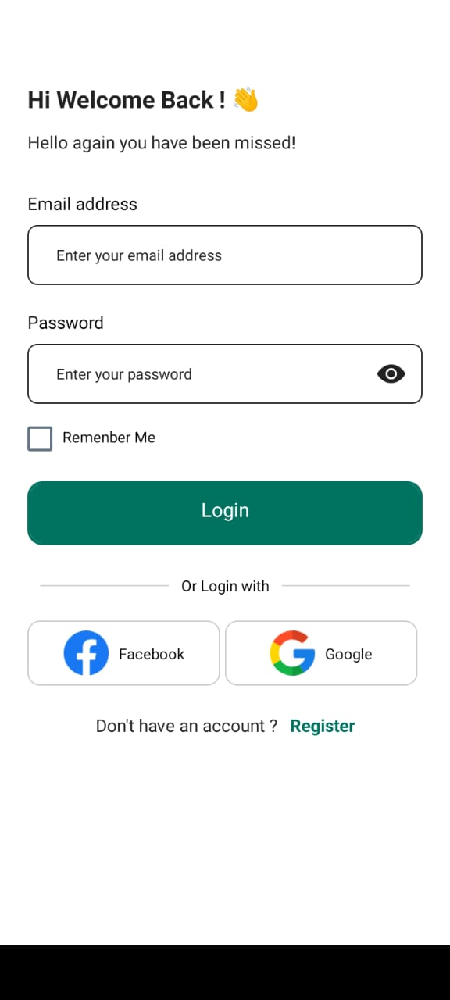
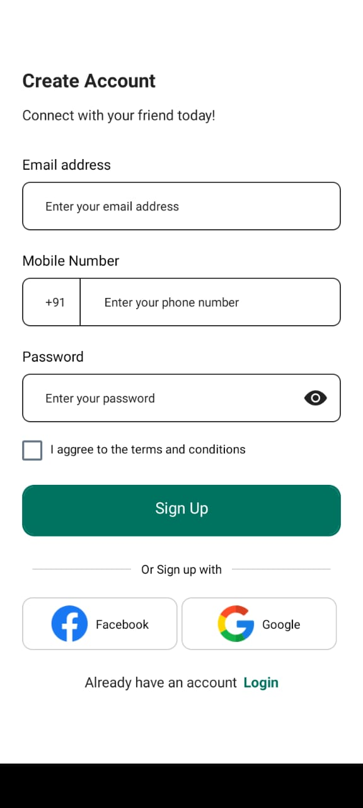
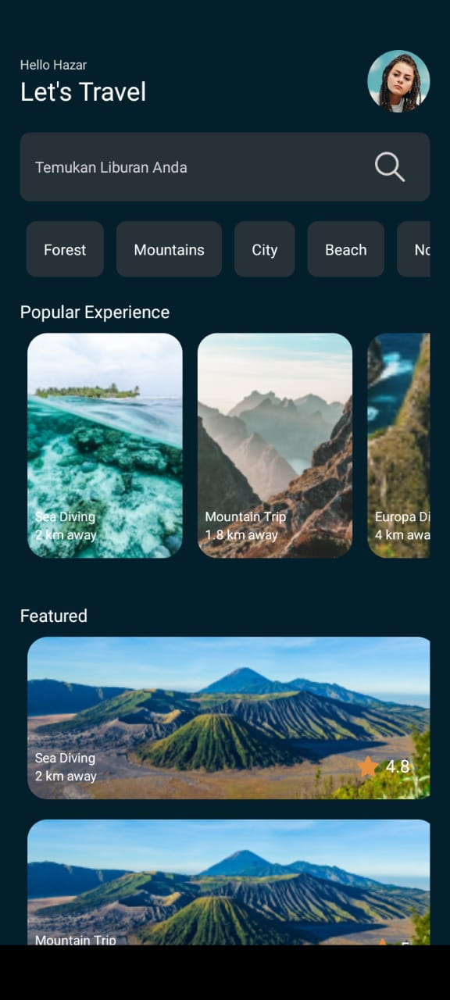

# Travel-App
In this repository you'll find the travel app is built on the robust foundation of React Native and JavaScript, ensuring a seamless, cross-platform experience. 


1. Install nodejs using below link
```
https://nodejs.org/en/download
```

2. Type node -v in cmd
To check whether the node js latest version is installed or not.

3. Clone this repository to your local machine:
```bash
git clone https://github.com/ZeenathZahra/Travel-App.git
```

4. Type npm install in command prompt
   
5. Install expo client in your phone from play store

6. To run this application:
   Type expo start in command prompt to run your project
```bash
expo start
```

7. Scan the QR code using your EXPO GO in your mobile.

## Preview

<div align="center">
  
  
  
  

</div>

